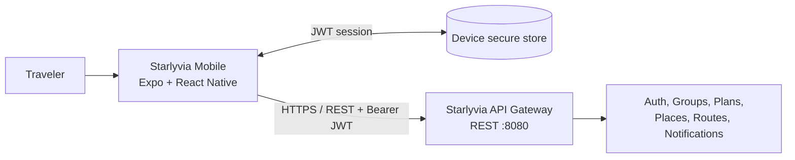
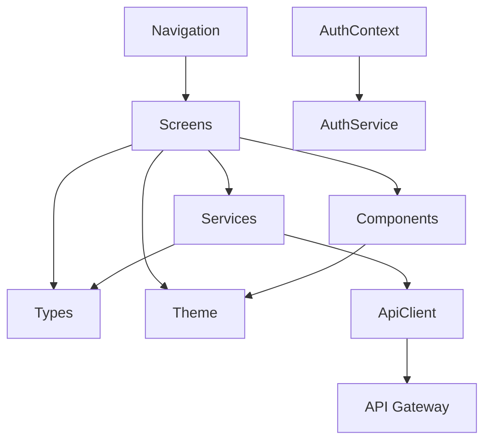
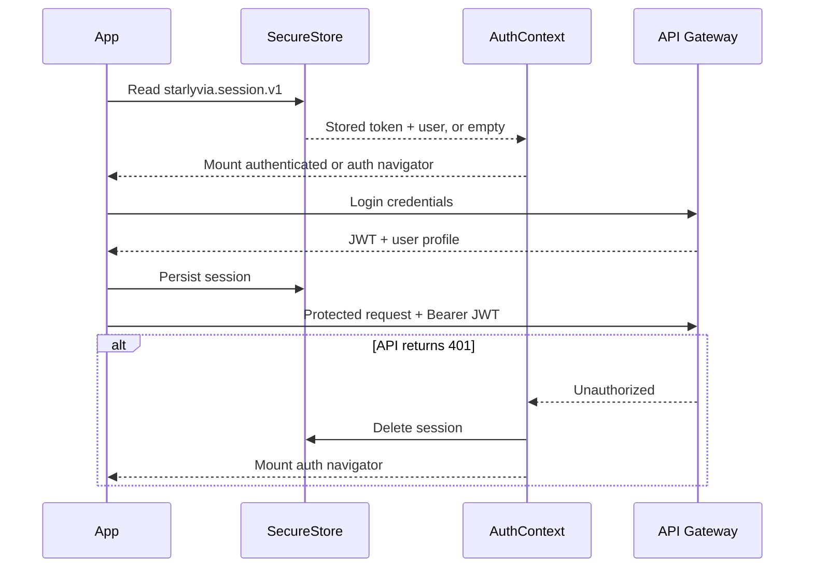

# Starlyvia Mobile Architecture

## 1. Purpose and scope

Starlyvia Mobile is a React Native client for the Starlyvia collaborative trip-planning backend in `../starlyvia`. The first release covers the backend's current public API:

- account registration, login, session restoration, and logout;
- travel groups, memberships, invitations, and member removal;
- group itineraries and ordered itinerary stops;
- Google-backed place autocomplete and place details;
- drive, walk, and bicycle route summaries;
- paginated notifications and read state.

The app is an Expo-managed React Native application targeting Android and iOS. Expo SDK 57 supplies React Native 0.86 and the New Architecture. React Navigation provides native stacks and bottom tabs.

## 2. System context



The client talks only to the API gateway. It never calls a service port directly and never sends the trusted internal `X-User-*` headers. The gateway validates the JWT and adds those headers downstream.

## 3. Architectural principles

1. **Backend contracts are the source of truth.** Types in `src/types/api.ts` mirror the Java request and response DTOs.
2. **Screens do not perform network requests directly.** A typed service layer owns endpoints, query strings, headers, and response types.
3. **Server state stays near the screen that consumes it.** React state plus focus-aware refresh is sufficient for the current app size; there is no extra global state library.
4. **Only identity is global.** `AuthContext` owns the restored user and token because every protected flow depends on them.
5. **Secure by default.** The JWT and user snapshot are stored with `expo-secure-store`, not plain async storage. Secrets and provider API keys remain on the backend.
6. **Explicit UI states.** Every data flow accounts for loading, refresh, empty, failure, disabled, and submission states.
7. **Native behavior first.** Native stacks preserve platform back gestures, tabs preserve Android back history, safe areas are respected, and forms avoid keyboard obstruction.

## 4. Source layout

```text
starlyvia-fe/
├── App.tsx                       # providers and navigation container
├── index.ts                     # Expo native entry point
├── src/
│   ├── components/              # reusable presentational UI
│   ├── context/
│   │   └── AuthContext.tsx      # session lifecycle and secure persistence
│   ├── navigation/
│   │   └── RootNavigator.tsx    # authenticated stack, auth stack, tabs
│   ├── screens/
│   │   ├── auth/                # login and registration
│   │   ├── groups/              # group, member, invitation flows
│   │   ├── main/                # four primary tabs
│   │   └── plans/               # itinerary and stop flows
│   ├── services/                # API transport and domain endpoint modules
│   ├── theme/                   # color, spacing, type, navigation tokens
│   ├── types/                   # API and navigation contracts
│   └── utils/                   # formatting, validation, IDs
├── .env.example
├── app.json
├── package.json
└── tsconfig.json
```

Dependencies point inward:



Presentational components do not import services. Services do not import screens, navigation, or components.

## 5. Navigation

The session decides which top-level navigator is mounted:

```text
Unauthenticated
└── AuthStack
    ├── Login
    └── Register

Authenticated
└── RootStack
    ├── MainTabs
    │   ├── Home
    │   ├── Groups
    │   ├── Notifications
    │   └── Profile
    ├── CreateGroup
    ├── Invitations
    ├── GroupDetail
    ├── CreatePlan
    ├── PlanDetail
    └── AddStop (modal)
```

Route parameters are centralized in `src/types/navigation.ts`; screens do not navigate with untyped parameter objects.

## 6. Session lifecycle



The API client receives token access and the unauthorized callback through `configureApiClient`. This avoids importing React context into service modules and prevents a circular dependency.

Registration is followed by login because the backend registration response does not issue a token.

## 7. Data access

`apiClient.ts` is the transport boundary. It owns:

- the environment-aware gateway base URL;
- JSON serialization and parsing;
- bearer token injection;
- status-to-user-message normalization;
- automatic session clearing after a protected `401`;
- URL query encoding.

Domain services keep endpoint knowledge out of UI code:

| Service | Backend area |
| --- | --- |
| `authService` | `/api/v1/auth/**` |
| `groupService` | `/api/v1/groups/**` |
| `planService` | `/api/v1/plans/**`, `/api/v1/plan-stops/**` |
| `placeService` | `/api/v1/places/**` |
| `notificationService` | `/api/v1/notifications/**` |

Screens fetch again on focus when another screen can mutate their data. Pull-to-refresh is available on server-backed primary views. Notifications use backend pagination and `FlatList`; place autocomplete debounces input and ignores stale results.

## 8. State ownership

| State | Owner | Reason |
| --- | --- | --- |
| JWT and current user | `AuthContext` | Shared across the entire app and persisted securely |
| Groups, plans, members | Consuming screen | Server state needed by one route at a time |
| Form fields/errors | Form screen | Temporary, unsaved UI state |
| Place search session/results | `AddStopScreen` | Short-lived Google session and query state |
| Route mode/result | `PlanDetailScreen` | Derived for one itinerary view |

A query cache can be introduced later if duplicated server state or offline behavior becomes significant. Adding one now would create more invalidation logic than value.

## 9. API base URL and local networking

`EXPO_PUBLIC_API_URL` overrides the gateway URL. The fallback is:

- Android emulator: `http://10.0.2.2:8080`
- iOS simulator: `http://localhost:8080`

A physical device must use the development machine's LAN address, for example `http://192.168.1.10:8080`, and the device and machine must share a network. Production must use an HTTPS gateway URL.

Only the gateway URL is a public build-time value. Google Places, OpenRouteService, JWT signing, and database secrets must remain in backend configuration.

## 10. Error and resilience model

- Transport errors explain which gateway URL could not be reached.
- Expected HTTP errors are converted into actionable, user-safe messages.
- Raw backend exception bodies are never shown; status codes map to controlled user-facing messages.
- Mutating buttons lock during submission to prevent duplicates.
- Notification read state is optimistic and rolls back on failure.
- Place search failures preserve manual stop entry.
- A missing provider key can prevent place or route lookup, but the rest of itinerary management remains usable.

## 11. Current backend gaps and client decisions

1. **No current-user plan listing.** The backend can retrieve one plan or list plans by group, but cannot list all plans created by the authenticated user. The mobile UI therefore creates plans inside groups so they remain discoverable. Add `GET /api/v1/plans` before surfacing solo plans.
2. **No user search/profile lookup REST endpoint.** Group invitations accept only `inviteeId`, and member objects expose only UUIDs. The client clearly labels the UUID input and displays a shortened identifier for other members. A user directory endpoint should replace this UX.
3. **No group update/delete endpoint.** The client does not show controls the backend cannot fulfill.
4. **No push registration or realtime stream.** Notifications refresh on focus, pull, and pagination. Push tokens and delivery require backend work.
5. **No map tile contract or chosen map provider.** Route geometry is typed and retained, but the MVP renders distance and duration rather than adding another provider key or native map dependency.
6. **No refresh token.** A rejected or expired JWT signs the user out. A refresh-token rotation API is required for uninterrupted long-lived sessions.

## 12. Testing strategy

The current automated static gate is TypeScript compilation without output:

```bash
npm run typecheck
npm run lint
```

Both commands currently run `tsc --noEmit`; no automated test runner is configured. The [coding conventions and linting guide](./docs/CODING_CONVENTIONS.md#10-static-checks-and-linting) records the exact scope and tooling gaps.

Recommended next tests:

- unit tests for validation, formatting, and API error normalization;
- service contract tests against a mocked gateway;
- component tests for empty/error/submission states;
- end-to-end tests for registration, group creation, itinerary creation, adding stops, route calculation, and invitation acceptance;
- Android emulator and iOS simulator smoke tests, plus at least one small physical device.

## 13. Evolution path

When product requirements justify them:

1. add a query cache for shared normalized server state and offline reads;
2. add a map adapter behind a component boundary, consuming the existing route geometry type;
3. add push notification registration and deep links to group or plan resources;
4. add background token refresh after the backend supports rotating refresh tokens;
5. add an offline mutation queue only after conflict semantics are defined server-side;
6. split feature folders further if teams begin owning separate domains.
